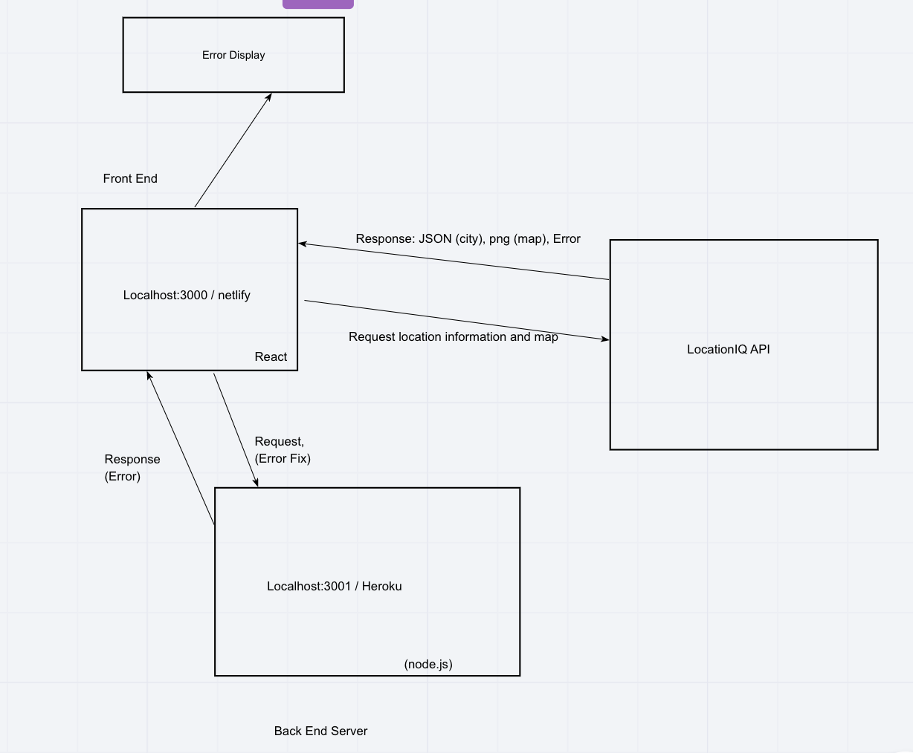

# City Explorer Api

**Author**: Chris Gantt
**Version**: 1.0.0

## Overview

<!-- Provide a high level overview of what this application is and why you are building it, beyond the fact that it's an assignment for this class. (i.e. What's your problem domain?) -->

## Getting Started

```bash
git clone https://github.com/ganttArt/codefellows-city-explorer.git
npm -i
npm start
```
<!-- What are the steps that a user must take in order to build this app on their own machine and get it running? -->

## Architecture

Node.js, Express.js, Cors, Dotenv, Heroku
<!-- Provide a detailed description of the application design. What technologies (languages, libraries, etc) you're using, and any other relevant design information. -->

## Change Log

<!-- Use this area to document the iterative changes made to your application as each feature is successfully implemented. Use time stamps. Here's an examples:

01-01-2001 4:59pm - Application now has a fully-functional express server, with a GET route for the location resource. -->

Name of feature: Setup server repository

- Estimate of time needed to complete: 20min
- Start time: 6pm
- Finish time: 6:18pm
- Actual time needed to complete: 18min

Name of feature: Weather (placeholder) Front and Backend + Error Handling

- Estimate of time needed to complete: 1hour
- Start time: 6:26pm
- Finish time: 8pm
- Start time: 1:30pm
- Finish time: 2:46pm
- Actual time needed to complete: 2hr 45min

Name of feature: Weather (live)

- Estimate of time needed to complete: 1hour
- Start time: 4:51pm
- Finish time: 5:22pm
- Actual time needed to complete: 1hr 1min

Name of feature: Movies api

- Estimate of time needed to complete: 1hour
- Start time: 7:30pm
- Finish time: 8:13pm
- Actual time needed to complete: 45min

Name of feature: Refactoring

- Estimate of time needed to complete: 20min
- Start time: 2:30pm
- Finish time: 2:49pm
- Actual time needed to complete: 19min

## Credit and Collaborations

[Mason Aviles](https://www.linkedin.com/in/masonaviles/) - API Request/Response Graphic
<!-- Give credit (and a link) to other people or resources that helped you build this application. -->

## More


